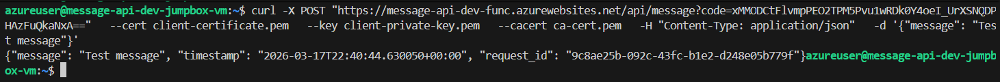
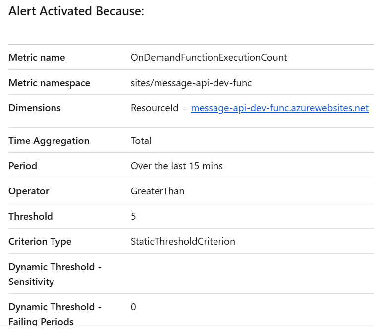

# Azure Function App - Message API Deployment Task

## Architecture overview

This project deploys a private internal API in Azure using an Azure Function App behind a private endpoint, with mutual TLS (mTLS) enforced at the platform level. All traffic remains on the Azure private backbone via private endpoints and VNet integration.

```
Client (with cert) → Private Endpoint → Function App (mTLS enforced) → Python logic
```


### Resources deployed

| Resource | Purpose |
|---|---|
| Virtual Network | Isolates all resources from the public internet |
| snet-func-int (10.0.1.0/24) | Function App VNet integration subnet |
| snet-pe (10.0.2.0/24) | Private endpoints subnet |
| NSGs | Least-privilege rules on each subnet |
| Azure Function App (Flex Consumption) | API logic — POST /api/message |
| Private Endpoint (Function App) | Internal-only API entry point |
| Key Vault | Stores CA cert, client cert, and private keys |
| Private Endpoint (Key Vault) | Keeps Key Vault off the public internet |
| Storage Account | Function App backing store |
| Private Endpoint (Storage) | Keeps storage off the public internet |
| Private DNS Zones | Internal hostname resolution for all private endpoints |
| Log Analytics Workspace | Centralised logging |
| Application Insights | Function App telemetry |
| Monitor Alert Rule | Fires when function execution count exceeds threshold |

---

## Prerequisites

- Azure CLI installed and authenticated
- Terraform >= 1.7.0
- GitHub repository with Actions enabled
- An Azure subscription

---

## Setup

### 1. Bootstrap — one-time manual steps

These resources must exist before the pipeline can run, as they are required for authentication and cannot be created by Terraform itself.

**Create the App Registration for OIDC:**

```bash
az ad app create --display-name "github-actions-oidc"
az ad sp create --id <app-id>
az role assignment create --role Contributor \
  --assignee <sp-object-id> \
  --scope /subscriptions/<subscription-id>
az role assignment create --role "User Access Administrator" \
  --assignee <sp-object-id> \
  --scope /subscriptions/<subscription-id>
```

**Add a federated credential** in the Azure Portal:

```
App Registration → Certificates & secrets → Federated credentials → Add credential
Scenario:     GitHub Actions deploying Azure resources
Organisation: <your-github-username>
Repository:   <your-repo-name>
Entity type:  Branch
Branch:       main
```

> Note: the subject identifier is case-sensitive and must exactly match
> `repo:<org>/<repo>:ref:refs/heads/main`

**Add GitHub Actions secrets** in your repository settings under Settings → Secrets and variables → Actions:

```
AZURE_CLIENT_ID       → App Registration → Application (client) ID
AZURE_TENANT_ID       → App Registration → Directory (tenant) ID
AZURE_SUBSCRIPTION_ID → Your Azure subscription ID
```

### 2. Deploy

Push to the `main` branch. The pipeline will automatically run:

1. `terraform fmt -check`
2. `terraform init`
3. `terraform validate`
4. `terraform plan`

To apply, trigger the workflow manually from the Actions tab and select `apply`.

### 3. Deploy function code

After infrastructure is deployed, deploy the Python function code from inside the `function` directory:

```powershell
cd function
Compress-Archive -Path .\* -DestinationPath ..\function.zip -Force
az functionapp deployment source config-zip `
  --resource-group message-api-dev-rg `
  --name message-api-dev-func `
  --src ..\function.zip
```

---

## Testing

Testing requires a client inside the VNet as the Function App has public network access disabled. A jumpbox VM (`message-api-dev-jumpbox-vm`) is deployed into `snet-jumpbox` for this purpose.

**SSH into the jumpbox:**

```bash
ssh -i ~/.ssh/id_rsa azureuser@<jumpbox-public-ip>
```

**Retrieve certificates from Key Vault using the jumpbox managed identity:**

```bash
TOKEN=$(curl -s -H "Metadata:true" \
  "http://169.254.169.254/metadata/identity/oauth2/token?api-version=2018-02-01&resource=https://vault.azure.net" \
  | python3 -c "import sys,json; print(json.load(sys.stdin)['access_token'])")

curl -s -H "Authorization: Bearer $TOKEN" \
  "https://message-api-dev-kv2.vault.azure.net/secrets/client-certificate?api-version=7.0" \
  | python3 -c "import sys,json; print(json.load(sys.stdin)['value'])" > client-certificate.pem

curl -s -H "Authorization: Bearer $TOKEN" \
  "https://message-api-dev-kv2.vault.azure.net/secrets/client-private-key?api-version=7.0" \
  | python3 -c "import sys,json; print(json.load(sys.stdin)['value'])" > client-private-key.pem

curl -s -H "Authorization: Bearer $TOKEN" \
  "https://message-api-dev-kv2.vault.azure.net/secrets/ca-certificate?api-version=7.0" \
  | python3 -c "import sys,json; print(json.load(sys.stdin)['value'])" > ca-cert.pem
```

**Test with valid client certificate:**

```bash
curl -X POST "https://message-api-dev-func.azurewebsites.net/api/message?code=<function-key>" \
  --cert client-certificate.pem \
  --key client-private-key.pem \
  --cacert ca-cert.pem \
  -H "Content-Type: application/json" \
  -d '{"message": "hello world"}'
```

**Successful response:**



The response confirms the function is reachable via the private endpoint (`10.0.2.5`), mTLS is completing successfully, and the function is returning the expected JSON payload with message, timestamp, and request ID.

---

## Observability

Application Insights is connected to the Log Analytics Workspace for centralised logging. An alert rule fires when the `OnDemandFunctionExecutionCount` metric exceeds 5 executions in a 15 minute window.

**Alert fired during testing:**



---

## Teardown

Navigate to your repository → **Actions** → **Terraform CI** → **Run workflow**, select `destroy`, and click **Run workflow**.

Key vaults are set to have a 7 day soft delete retention and are purge protected.

> **Important:** teardown via the pipeline requires remote state to be configured (see below).
> Without remote state the runner has no record of what was deployed and cannot destroy it.

---

## Remote state

Remote state is configured using Azure Blob Storage. The state storage account is intentionally separate from the application infrastructure so that `terraform destroy` does not delete the state itself. I hadn't originally planned to implement this, but the lack of state was making things difficult when troubleshooting.

**Bootstrap resources (created once manually):**

```bash
az group create --name rg-terraform-state --location westeurope
az storage account create \
  --name tfstateabc12345 \
  --resource-group rg-terraform-state \
  --sku Standard_LRS \
  --allow-blob-public-access false
az storage container create \
  --name tfstate \
  --account-name tfstateabc12345
```

**Backend configuration in `main.tf`:**

```hcl
terraform {
  backend "azurerm" {
    resource_group_name  = "rg-terraform-state"
    storage_account_name = "tfstateabc12345"
    container_name       = "tfstate"
    key                  = "dev/terraform.tfstate"
  }
}
```

---

## Assumptions and known limitations

**Key Vault firewall**
The Key Vault network ACL is set to `default_action = "Allow"` to permit the GitHub Actions runner to write secrets during deployment. In production this would be resolved by using a self-hosted runner deployed inside the VNet, with the ACL locked to the VNet subnet only.

**Service plan SKU**
EP1 (Elastic Premium) was the intended SKU as it is the standard plan for VNet-integrated Function Apps. However, the Azure free tier subscription has a quota of zero for Elastic Premium VMs. Flex Consumption (`FC1`) was used instead as it also supports VNet integration. The region was changed from `uksouth` to `westeurope` due to quota availability.

**mTLS enforcement**
`client_certificate_mode = "Required"` validates that a client certificate is presented before requests reach the function code. Full CA chain validation (confirming the certificate is signed by the specific CA generated in this project) would require additional configuration such as Application Gateway with a custom truststore, or thumbprint validation inside the function itself.

**Flex Consumption resource**
`azurerm_function_app_flex_consumption` required `azurerm` provider `~> 4.21`. There are known open issues around Managed Identity stability on this resource type. This is noted as a limitation and would be monitored in a production deployment.

**Key Vault naming**
The Key Vault is named `message-api-dev-kv2` rather than `message-api-dev-kv`. This is due to the soft-delete retention — the original vault name was reserved for 7 days after a failed deployment. The `-kv2` suffix was used to avoid the naming conflict after redeploying.

**Jumpbox**
A jumpbox VM is included for testing purposes only. It should be destroyed after testing to avoid ongoing costs. It can be removed by deleting `jumpbox.tf` and running apply, or by running a targeted destroy:

```bash
terraform destroy \
  -target=azurerm_linux_virtual_machine.jumpbox \
  -target=azurerm_network_interface.jumpbox \
  -target=azurerm_public_ip.jumpbox \
  -target=azurerm_network_security_group.jumpbox \
  -target=azurerm_subnet.jumpbox
```

---

## Costs
The current costs for the deployed resources are very low and there aren't currently enough datapoints for an accurate prediction of future costs. Given more time, I would enter these resources into the Azure pricing calculator to get predicted costs for various scenarios.

## AI usage and critique

This project was developed with assistance from Claude (Anthropic). The following patterns were identified and corrected during review:

- The initial output included both API Management and a Function App private endpoint simultaneously. The brief requires one or the other — APIM was removed in favour of the private endpoint approach for simplicity.
- `private_endpoint_network_policies_enabled` was used in the initial output but this argument is deprecated in `azurerm ~> 3.x`. Replaced with `private_endpoint_network_policies = "Disabled"`.
- The initial output used `EP1` as the service plan SKU. This was changed to `FC1` (Flex Consumption) due to quota restrictions on the test subscription.
- The initial `azurerm_linux_function_app` resource was not compatible with the `FC1` SKU. The correct resource type is `azurerm_function_app_flex_consumption`. All references across `keyvault.tf`, `observability.tf`, and `outputs.tf` had to be updated accordingly.
- `WEBSITE_CONTENTSHARE`, `WEBSITE_RUN_FROM_PACKAGE`, and other legacy app settings were included in the initial output but are unsupported on Flex Consumption and would cause deployment errors.
- The storage account access key is passed directly to the function app resource. In production this would be replaced with Managed Identity authentication to avoid credentials in Terraform state.
- CA and client private keys are stored in Terraform state in plaintext as a result of using the `tls` provider. In production these would be generated outside Terraform and imported, or managed via a dedicated secrets management workflow.
- The initial alert rule used `Http5xx` as the metric name which is not available on Flex Consumption. This was changed to `OnDemandFunctionExecutionCount`.
- The subnet delegation for the function integration subnet was initially set to `Microsoft.Web/serverFarms`. Flex Consumption requires `Microsoft.App/environments`.
- The main issues came around testing the API, due to the private endpoints and having no public network access. Initially, I had explored using a cloud shell, but ran into some issues with this requiring a network profile and relay. I eventually opted for a jumpbox, all contained within one Terraform file, to make it much more simple to remove this individual resource after testing. There were some further issues with SKUs for the VM not being supported and I experimented with different regions, before eventually upgrading from Azure free tier to PAYG. This resolved my issues here.
- This README was generated from notes made throughout the development process and reviewed and edited manually.